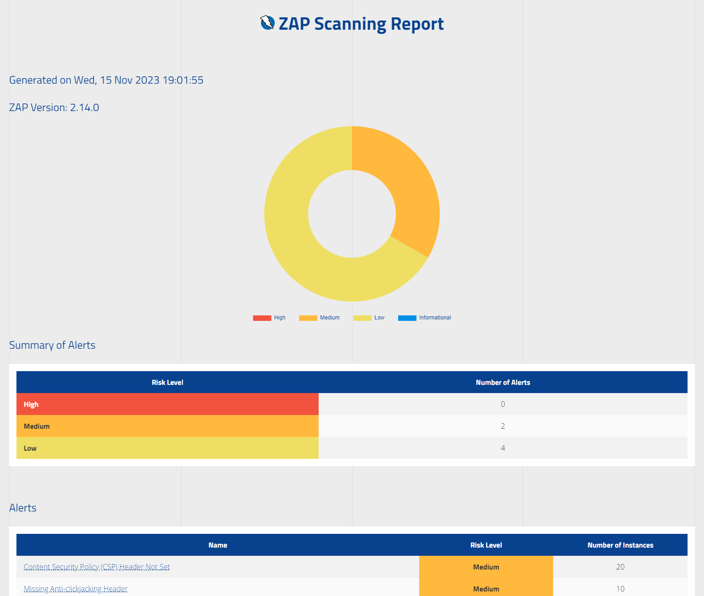

# Security scanning with ZAP

## Overview

You an create detailed security scans of your app with [Zed Attack Proxy (ZAP)](https://www.zaproxy.org/) right from the Lombiq UI Testing Toolbox, with nice reports. ZAP is the world's most widely used web app security scanner, and a fellow open-source project we can recommend.

- The most important default ZAP scans, Baseline, Full, GraphQL, and OpenAPI scans are included and readily usable. Note that these are modified to be more applicable to Orchard Core apps run on localhost during a UI testing scenario (notably, [`ajaxSpider`](https://www.zaproxy.org/docs/desktop/addons/ajax-spider/automation/) is removed, since most Orchard Core apps don't need it but it takes a lot of time, and rules as well as selected technologies are adjusted). If you want to scan remote (and especially production) apps, then you'll need to create your own scans based on ZAP's default ones. These can then be run from inside UI tests too.
- You can assert on scan results and thus fail the test if there are security warnings.
- Since we use [ZAP's Automation Framework](https://www.zaproxy.org/docs/automate/automation-framework/) for configuration, you have complete and detailed control over how the scans are configured, but you can also start with a simple configuration available in the .NET API.
- [SARIF](https://sarifweb.azurewebsites.net/) reports are available to integrate with other InfoSec tools.

## Working with ZAP in the Lombiq UI Testing Toolbox

- We recommend you first check out the [related samples in the `Lombiq.Tests.UI.Samples` project](../../Lombiq.Tests.UI.Samples/Tests/SecurityScanningTests.cs).
- If you're new to ZAP, you can start learning by checking out [ZAP's getting started guide](https://www.zaproxy.org/getting-started/), as well as the [ZAP Chat Videos](https://www.zaproxy.org/zap-chat/). The [documentation on ZAP's Automation Framework](https://www.zaproxy.org/docs/automate/automation-framework/) and the [ZAP Chat 06 Automation Introduction vide](https://www.youtube.com/watch?v=PnCbIAnauD8) will help you understand what we use under the hood to instruct ZAP, and will allow you to use your completely custom Automation Framework plans too.
- Be aware that ZAP scans run its own spider or with an internally managed browser instance, not in the browser launched by the test.
- While ZAP is fully managed for you, Docker needs to be available and running to host the ZAP instance. On your development machine you can install [Docker Desktop](https://www.docker.com/products/docker-desktop/).
- The full scan of a website with even just 1-200 pages can take 5-10 minutes. So, be careful to fine-tune the ZAP configuration to make it suitable for your app.

## Troubleshooting

- If you're unsure what happens in a scan, run the [ZAP desktop app](https://www.zaproxy.org/download/) and load the Automation Framework plan's YAML file into it. If you use the default scans, then these will be available under the build output directory (like _bin/Debug_) under _SecurityScanning/AutomationFrameworkPlans_. Then, you can open and run them as demonstrated [in this video](https://youtu.be/PnCbIAnauD8?si=u0vi63Uvv9wZINzb&t=1173).
- If an alert is a false positive, follow [the official docs](https://www.zaproxy.org/faq/how-do-i-handle-a-false-positive/). You can use the [`alertFilter` job](https://www.zaproxy.org/docs/desktop/addons/alert-filters/automation/) to ignore alerts in very specific conditions. You can also access this via the .NET configuration API.
- ZAP didn't find everything in your app? By default, ZAP has a crawl depth of 5 for its standard spider and 10 for its AJAX spider. Set `maxDepth` (and `maxChildren`) [for `spider`](https://www.zaproxy.org/docs/desktop/addons/automation-framework/job-spider/) and `maxCrawlDepth` [for `spiderAjax`](https://www.zaproxy.org/docs/desktop/addons/ajax-spider/automation/).
- Do you sometimes get slightly different scan results? This is normal, and ZAP can be inconsistent/appear random within limits, see [the official docs page](https://www.zaproxy.org/faq/why-can-zap-scans-be-inconsistent/).
